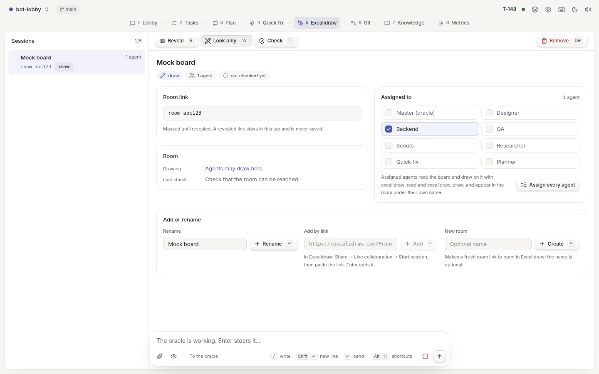

# Bot-Lobby

A [Pi](https://pi.dev) extension for multi-agent software development. Describe a change, agree a plan
with the oracle, and follow the agents in a local browser lobby. Approvals, domain boundaries and QA
are enforced before anything is called done.


## Install

```bash
pi install npm:@a-t-h-i/bot-lobby
```

Try it first with `pi -e npm:@a-t-h-i/bot-lobby`, or from a checkout with `pi -e ./src/index.ts`.
The questionnaire and web tools are built in, so don't also install extensions with the same tool names.

## Use

1. In Pi, run `/bot-lobby add a login page`. Bot-lobby turns on and the lobby opens in your browser.
   A new pi session starts with bot-lobby off, as plain pi: `Ctrl+Shift+M` or `/bot-lobby on|off` switches it.
2. Answer the oracle's questions and approve its plan, or agree one with the panel in **Plan** first.
3. Follow the agents in **Lobby**. Models, effort and time limits are in **Settings**.

Small changes go to **Quick fix**. `--task` forces a full task, `--fast` / `--full` picks the workflow,
and `--branch` / `--worktree` isolates it in git. A finished isolated task pushes its branch and tries
to open a PR through `gh`; nothing merges on its own.

After every worker step, before QA and at completion, the engine runs the project's own linter
(ESLint, Biome, Oxlint, Ruff, or a command you set) on the files the task touched. Only problems on
changed lines count, and QA judges any lint suppression a worker adds. **Settings → Linting** sets it
to off, advise or block. Visual questions come with mockups that expand and scroll side by side.

| Agent | Does |
| --- | --- |
| Oracle | Your Pi session: questions, plan, delegation and approvals |
| DESIGN | UI, frontend logic, styling and accessibility |
| DEV | Backend, APIs, data, security and integrations |
| QA | Targeted tests and the final quality gate |
| RESEARCH | External facts, with sources |

## Keys

The lobby is keyboard-first, and every action button shows its key (`Archive E`, `Delete Del`).
`Alt+1`…`Alt+9` switch tabs, `j` / `k` move through lists, `/` focuses search or the message box,
`p` switches project, `d` flips the theme and `?` lists every key. Alt and Ctrl shortcuts can be
rebound with `lobby.keys`. In Pi, `Alt+G` toggles auto mode and `Ctrl+Shift+M` turns bot-lobby on or off.

## Screenshots

| Plan | Tasks |
| --- | --- |
|  |  |
| **Thinking** | **Excalidraw** |
|  |  |

## Configuration

Settings live in `~/.pi/bot-lobby/config.json` (`BOT_LOBBY_CONFIG_DIR` moves them), and
`/bot-lobby config` shows what is in effect. Tasks and project knowledge stay in `.pi/bot-lobby/`
inside your project.
