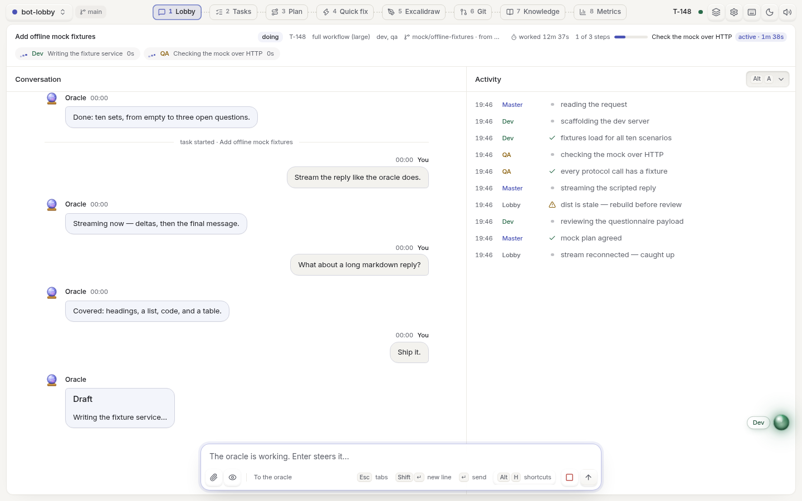
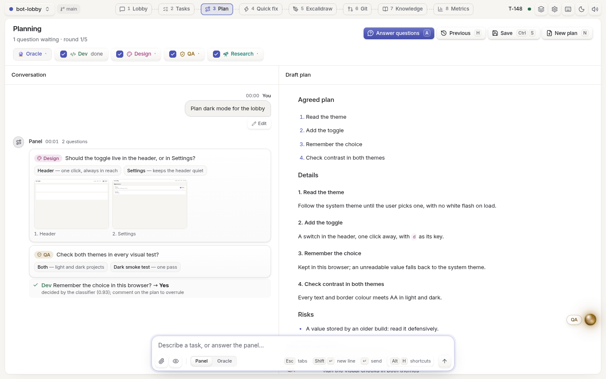
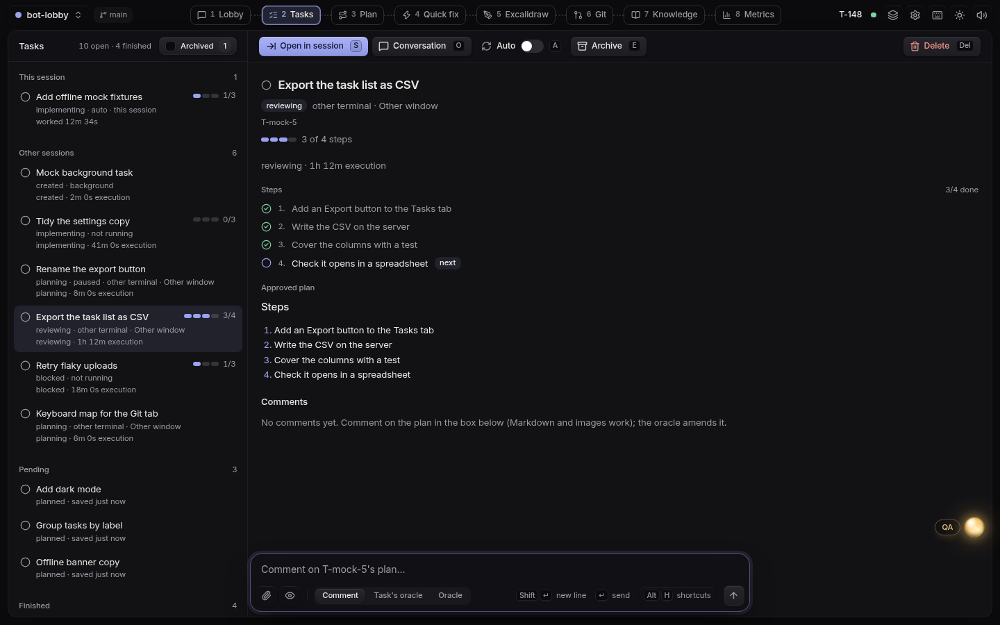
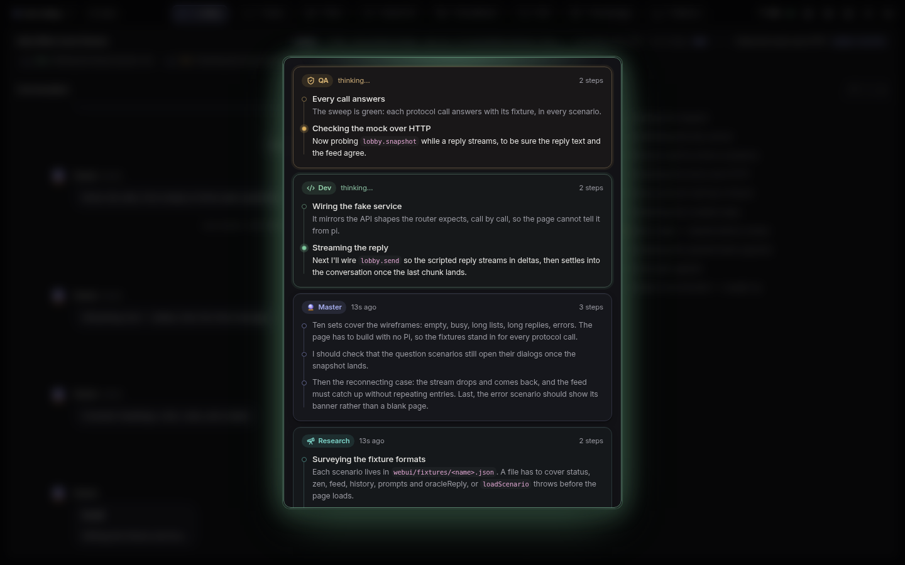
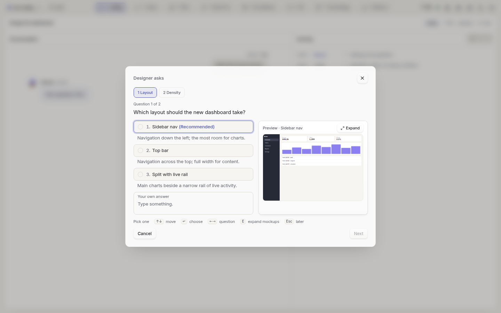
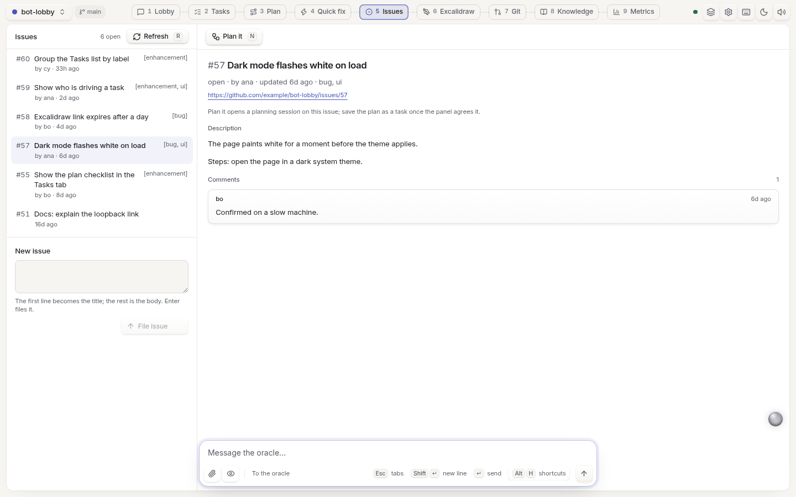
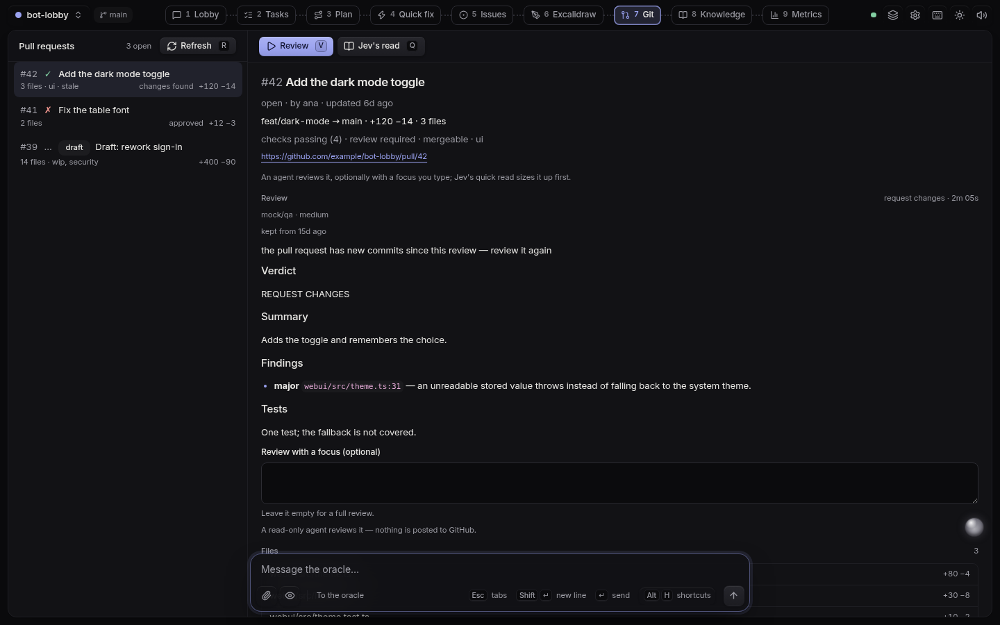

# Bot-Lobby

A [Pi](https://pi.dev) extension for multi-agent software development. Describe a change, agree on a
plan with the oracle, and follow the agents in a local browser lobby. Approvals, domain boundaries and QA
are enforced before anything is called done.



## Install

```bash
pi install npm:@a-t-h-i/bot-lobby
```

Try it first with `pi -e npm:@a-t-h-i/bot-lobby`, or from a checkout with `pi -e ./src/index.ts`.
The questionnaire and web tools are built in, so don't also install extensions with the same tool names.

## Use

1. In Pi, run `/bot-lobby add a login page`. Bot-lobby turns on and the lobby opens in your browser.
   A new Pi session starts with bot-lobby off, as plain Pi: `Ctrl+Shift+M` or `/bot-lobby on|off` switches it.
2. Answer the oracle's questions and approve its plan, or agree on one with the panel in **Plan** first.
   A plan opens with a short list of steps; the detail of each follows for whoever wants it.
   Plans you leave without saving them as a task wait under **Plan → Previous**. You can read, carry on,
   archive or delete them there. A plan saved as a task leaves that list.
3. Follow the agents in **Lobby**: the step being worked on reads `active · 1m 12s`, and each task shows
   how long its agents have worked on it (idle time left out). Models, effort and time limits are in **Settings**.

**Issues** lists the repository's open issues (with `lobby.issues` on), and **Plan it** starts a
planning session from one. **Git** lists open pull requests; an agent reviews one on request,
read-only, and nothing is posted to GitHub. Both read GitHub through `gh`.

Small changes go to **Quick fix**. `--task` forces a full task, `--fast` / `--full` picks the workflow,
and `--branch` / `--worktree` isolates it in git. A finished isolated task pushes its branch and tries
to open a PR through `gh`; nothing merges on its own.

After every worker step, before QA and at completion, the engine runs the project's own linter
(ESLint, Biome, Oxlint, Ruff, or a command you set) on the files the task touched. Only problems on
changed lines count, and QA judges any lint suppression a worker adds. **Settings → Linting** sets it
to off, advise or block. Visual questions come with mockups that expand and scroll side by side.

QA is sized to what was built, not to the request. Once the work is in, Jev (the fast classifier)
reads the diff and sets the QA risk. A change with nothing that runs (docs, styles, comments) passes
on the engine's checks with no QA agent, and a small one gets a light check. One that touches
security, data, concurrency or orchestration gets a deep, adversarial review. The test budget is a
ceiling, never a quota, and the Tasks tab shows Jev's read and why. With Jev off, the engine's rules decide.

If Pi crashes, is killed or loses its terminal, the lobby page keeps everything on screen and
reconnects when Pi is back. The next Pi started in the project carries on what was running. The
planning session returns as it was, and a round that was cut off runs again. Queued quick fixes
run, and every task's session starts again from its saved file, picking up where it stopped. A
quit on purpose stops this work, and `pi -c` brings back the planning session.

A task that is paused, or that no running session drives, shows **Resume** (`R`) in **Tasks**.
It carries the task on without moving your window: a paused task is unpaused where it runs, and a
stopped one carries on in a background session, which restarts its own session when its file is found.

| Agent | Does |
| --- | --- |
| Oracle | Your Pi session: questions, plan, delegation and approvals |
| DESIGN | UI, frontend logic, styling and accessibility |
| DEV | Backend, APIs, data, security and integrations |
| QA | The final quality gate, at the depth the change's risk calls for |
| RESEARCH | External facts, with sources |

## Keys

The lobby is keyboard-first, and every action button shows its key (`Archive E`, `Delete Del`).
`Alt+1`…`Alt+9` switch tabs, `j` / `k` move through lists, `/` focuses search or the message box,
`p` switches project, `d` flips the theme and `?` lists every key. Alt and Ctrl shortcuts can be
rebound with `lobby.keys`. In Pi, `Alt+G` toggles auto mode and `Ctrl+Shift+M` turns bot-lobby on or off.

## Screenshots

| Planning | Tasks |
| --- | --- |
|  |  |
| **Thinking** | **Questionnaire** |
|  |  |
| **Issues** | **Git** |
|  |  |

## Configuration

Settings live in `~/.pi/bot-lobby/config.json` (`BOT_LOBBY_CONFIG_DIR` moves them), and
`/bot-lobby config` shows what is in effect. Colour themes you import, under a name you choose,
are kept in `themes.json` beside it, so every Pi session and project shows them. Tasks and
project knowledge stay in `.pi/bot-lobby/` inside your project.
