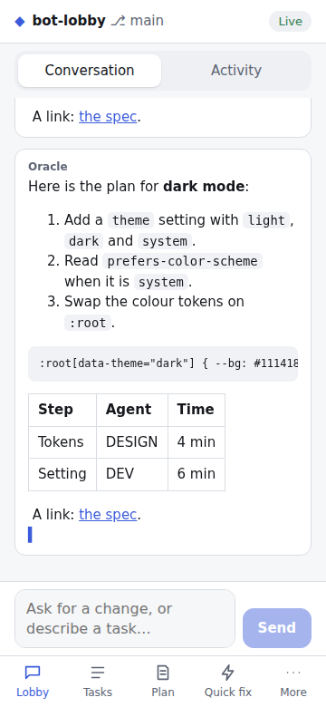
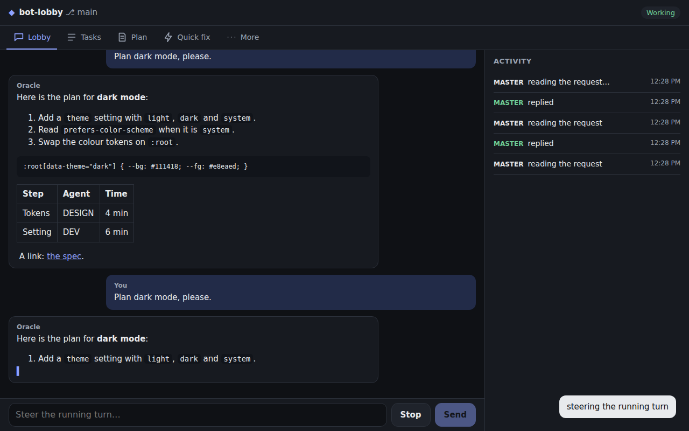

# bot-lobby web UI: the handbook

This folder is the handover for adding a **web UI** to bot-lobby. The web UI is a local, mobile-responsive web view of the lobby. It runs on Pi, the way bot-lobby does today, and shows everything the terminal lobby shows, with:
- real Markdown, images and charts;
- layouts for phones, tablets and desktops.

**What this folder holds:**
- the plan and the decisions;
- maps from every lobby feature and file to its place in the web UI;
- notes on the parts of Pi it relies on;
- a **working starter** (server + page), checked in a real browser at phone, tablet and desktop sizes.

The work happens **in this repository**, by a swarm of agents (D-03).

## What we are building

- **A view of the lobby in the browser.** bot-lobby stays a Pi extension (D-01). In Pi, `/bot-lobby web` prints a link such as `http://127.0.0.1:7347/#token=…` and opens it.
- **The terminal lobby keeps working.** Both views show the same state, live.
- **Phone first** (D-09):
  - on Android, run Pi in Termux and open the link in Chrome on the same device;
  - on a tablet in landscape or on a desktop, the panes sit side by side as in the terminal.
- **Safe by default** (D-12): only this machine, and only whoever has the link. Nothing that a model writes can run in the page.
- **In stages** (D-14):
  1. the Lobby tab and answering questions;
  2. every other tab;
  3. settings, notifications and installing it as an app on the phone.

  A standalone desktop app is a possible later phase (D-20).

 

*The starter, with a fake oracle, at 360 px and at 1280 px in dark mode.*

## Reading order

| # | File | Read it for |
| --- | --- | --- |
| 1 | [DECISIONS.md](DECISIONS.md) | What is fixed, what is adopted, what waits on a spike, and open questions with defaults |
| 2 | [ARCHITECTURE.md](ARCHITECTURE.md) | The shape: the service seam, topics, the server and its API, the page, questions, lifetime, fences |
| 3 | [PLAN.md](PLAN.md) | The phased plan: task cards with lanes, dependencies and "done when" |
| 4 | [AGENT-GUIDE.md](AGENT-GUIDE.md) | How to work, the rules, the traps already found, the definition of done |
| 5 | [SURFACE-MAP.md](SURFACE-MAP.md) | Every terminal lobby file and its web counterpart; the view models to share |
| 6 | [FEATURE-INVENTORY.md](FEATURE-INVENTORY.md) | Every lobby feature (W-01…W-154) with source, tests and task: the parity checklist |
| 7 | [DEV-ENVIRONMENT.md](DEV-ENVIRONMENT.md) | Running the page with and without Pi, Android and Termux, SSH tunnels |
| 8 | [TESTING.md](TESTING.md) | Test levels, server tests, UI checks at five sizes, walkthroughs |
| 9 | [RISKS.md](RISKS.md) | What could go wrong, and who owns it |
| 10 | [SOURCES.md](SOURCES.md) | Where everything comes from, with versions |
| — | [reference/PI-NOTES.md](reference/PI-NOTES.md) | The parts of Pi 0.87 the web UI relies on, with source lines |
| — | [reference/VERIFIED-FACTS.md](reference/VERIFIED-FACTS.md) | What was run, and what it showed |
| — | [starter/](starter) | The working first slice: server, page, tests, browser check |
| — | [STATUS-TEMPLATE.md](STATUS-TEMPLATE.md) | The status board P0-01 copies to `docs/web-ui/status.md` |

## Where things stand at handover

| Status | Item |
| --- | --- |
| ✅ Verified | **The starter's server:** loopback, link token → cookie, Host/Origin/JSON checks, CSP, an event stream with coalesced reply frames. 10 of 10 tests pass |
| ✅ Verified | **The starter's page** at 360, 412, 800, 1280 and 1440 px, light and dark: streamed Markdown, no HTML runs, no sideways scroll, reload stays signed in. 92 of 92 browser checks pass; about 33 KB gzipped |
| ⬜ First swarm tasks | P0-01 (toolchain) and the spikes P0-02…P0-06, in parallel; P0-07 (wireframes, for the user to approve) |
| ⬜ Everything else | Phases 1–5 in [PLAN.md](PLAN.md) |

## How the swarm should start

1. **Day one, in parallel:**
   - one agent on **P0-01**;
   - one agent each on **P0-02**, **P0-04**, **P0-05** and **P0-06**;
   - one on **P0-07** (wireframes).

   **P0-03** needs the user's Android device, so ask the user to run it with the starter.
2. **When P0-06 lands:** **P1-01**, then **P1-02**…**P1-05**. They all touch `runtime.ts`, so keep them in sequence, or coordinate closely.
3. **When P1-01 and P0-02 land:** Lane B starts the server (P2-01…). **P2-09** (the mock server) comes early, so Lane C can build against it.
4. **When P0-07 is approved and P2-09 lands:** Lane C builds the shell and the Lobby tab (P3-01…P3-07). Then **P3-X**: the user tries it on the phone.
5. **Phase 4:** one agent per tab.

The coordination files, `docs/web-ui/status.md` and `docs/web-ui/parity.md`, are created by P0-01.

## Rules everyone follows

These are expanded in [AGENT-GUIDE.md](AGENT-GUIDE.md):
- **Commit identity:** commit as **`a-t-h-i <aonlysmith@gmail.com>`**, with **no co-author trailers**.
- **The terminal lobby is the specification**, and it must keep working: every existing test passes on every PR.
- **One place for logic:** the service. The server and the page only carry and lay out.
- **Untrusted text:** everything a model or another person wrote is untrusted. Sanitized Markdown only.
- **Secrets:** never in responses or logs.
- **Phone first:** 44 px targets, no sideways scroll, 16 px fields.
- **No output from the server** to stdout or stderr.

## Glossary

| Term | Meaning |
| --- | --- |
| **Pi** | The coding agent bot-lobby extends (`@earendil-works/pi-coding-agent`) |
| **The terminal lobby** | bot-lobby's full-screen view in Pi's TUI (`alt+l`) |
| **The web UI, the page** | What this plan builds: `webui/` served by `src/webui/` |
| **Service** | `LobbyService`: every read and action both UIs use (D-05) |
| **Topic** | A named part of the state whose changes the page is told about (`lobby`, `tasks`, …) |
| **Prompt hub** | Where bot-lobby's questions go so the terminal and the page can both answer (D-13) |
| **Oracle / Master** | The session's own agent, which plans, delegates and decides |
| **Background session** | A task running in its own headless Pi process, driven from the lobby |
| **Spike** | A short experiment that settles one question before building on it |
| **Starter** | `web-ui-mode/starter/`: the verified first slice the tasks lift code from |
